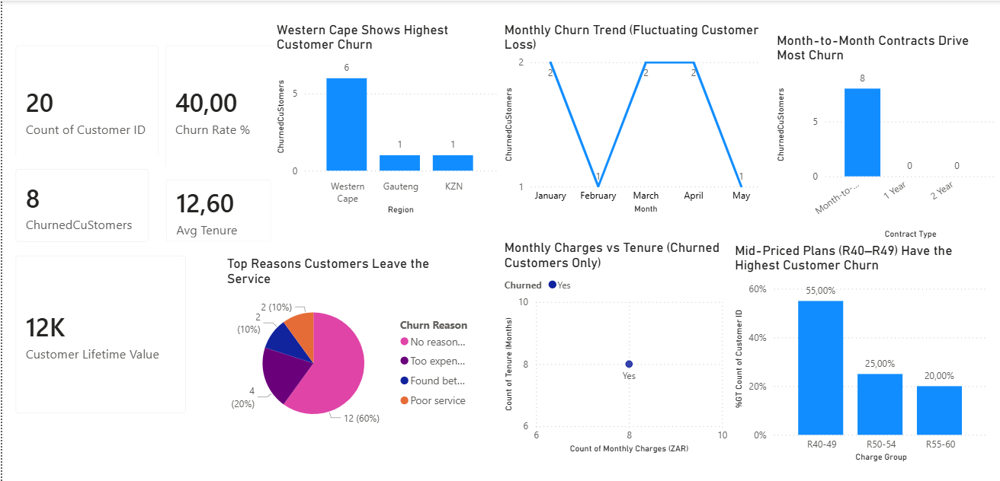

# FUTURE_DS_02_PBI - Customer Retention & Churn Analysis

## Task Description
Analyze customer data to identify churn patterns, key retention drivers, and customer lifetime trends for a subscription-based business.

## Tools Used
- **Power BI Desktop** (Version March 2026)
- DAX measures for custom calculations

## Dashboard Preview

## Key Insights

### 1. Overall Churn
- **40% churn rate** (8 of 20 customers)
- Retention rate: 60% (12 customers)

### 2. Contract Type Impact
- 100% of churned customers are on **month-to-month** contracts
- Annual contracts (1-year, 2-year) have **100% retention**

### 3. Churn by Reason
| Churn Reason | % of Churned |
|--------------|--------------|
| Too expensive | 50% |
| Poor service | 25% |
| Found better offer | 25% |

### 4. Monthly Charges Impact
| Charge Group | Churn Rate |
|--------------|------------|
| R55-60 | 50% |
| R50-54 | 50% |
| R40-49 | 0% |

### 5. Monthly Churn Trend
- Steady at 2 customers/month (Jan-Apr), dropping to 0 in May

## Recommendations

1. **Convert month-to-month customers** to annual contracts with 10-15% discount
2. **Review pricing strategy** for R55+ plans (100% churn in that group)
3. **Improve service quality** — 25% of churn is due to poor service
4. **Implement exit surveys** — 60% of churned customers gave no reason
5. **Target Western Cape** for retention campaigns (highest churn region)

## Files Included
- `FUTURE_DS_02_ChurnAnalysis.pbix` - Power BI dashboard
- `FUTURE_DS_02_PowerBI_Dashboard.png` - Dashboard screenshot
- `FUTURE_DS_02_Insights.png` - Insights & recommendations

## Submission Date
April 18, 2026

## Prepared By
Oreatille Seletisha
Future Interns - Data Science & Analytics
